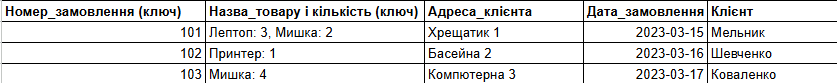
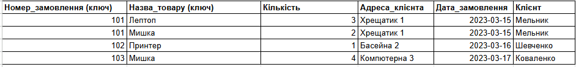
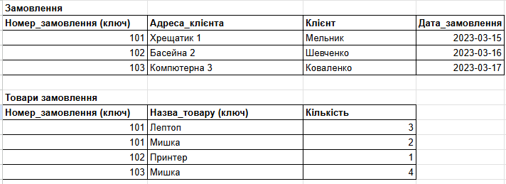
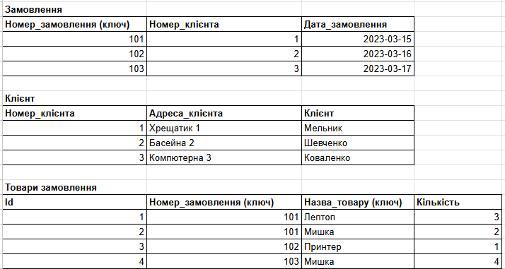
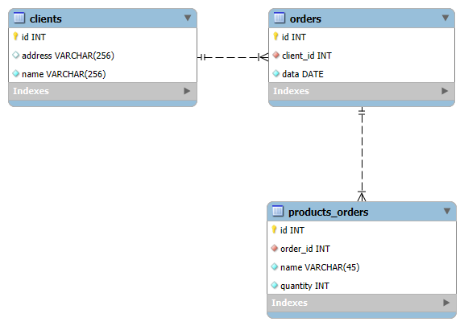

## Домашнє завдання до Теми 2. Проектування баз даних з використанням семантичних моделей

### Виконана робота
1. Переведена початкова таблиця в першу нормальну форму.
2. Переведена нова таблиця в другу нормальну форму.
3. Переведені нові таблиці в третю нормальну форму.
4. Розроблена ER-діаграма отриманих таблиць.

### Початкова таблиця 

### Переведена початкова таблиця в першу нормальну форму

### Переведена нова таблиця в другу нормальну форму

### Переведені нові таблиці в третю нормальну форму

### Розроблена ER-діаграма отриманих таблиць.

### Для довідок 
https://docs.google.com/spreadsheets/d/19UhlOMJRRQIaY7M3ItCQT5vX-69v52IwjBnsFOOEUR4/edit?usp=sharing